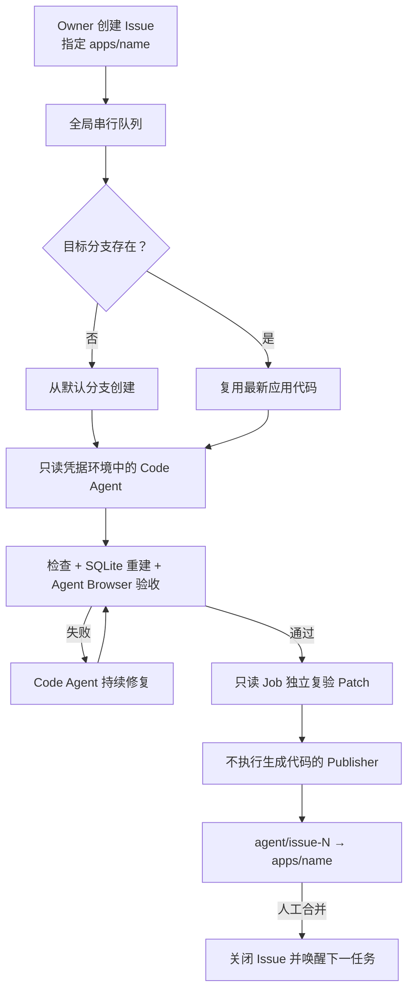

<!-- factory:readme:start -->

# nb3-factory

一个独立的 NocoBase 3 软件工厂实验仓库：你在 GitHub Issue Form 中写业务需求，GitHub Actions 串行调用 Code Agent 修改应用、自动验证，并向 Issue 指定的长期应用分支发起 Pull Request。



## 使用前配置

在仓库 `Settings → Secrets and variables → Actions` 中配置：

| 类型     | 名称                                    | 必填 | 说明                                                                                                      |
| -------- | --------------------------------------- | ---- | --------------------------------------------------------------------------------------------------------- |
| Secret   | `CODE_AGENT_API_ENDPOINT`               | 是   | Code Agent 使用的模型 API Base URL                                                                        |
| Secret   | `CODE_AGENT_API_KEY`                    | 是   | 模型 API Key                                                                                              |
| Variable | `CODE_AGENT_MODEL`                      | 是   | 自定义 Provider 中的模型 ID                                                                               |
| Variable | `CODE_AGENT_API_TYPE`                   | 否   | 默认 `openai-completions`；也支持 `openai-responses`、`anthropic-messages`、`google-generative-ai`        |
| Variable | `CODE_AGENT_THINKING`                   | 否   | 默认 `max`                                                                                                |
| Variable | `CODE_AGENT_VERSION`                    | 否   | 默认固定为 `0.84.4`                                                                                       |
| Variable | `CODE_AGENT_ENGINE`                     | 否   | 选择已注册的执行器；当前内置 `pi`，留空使用内置默认值                                                     |
| Variable | `AGENT_BROWSER_VERSION`                 | 否   | 默认固定为 `0.36.0`；用于登录后逐条执行 Issue 验收要求                                                    |
| Variable | `CODE_AGENT_AUTH_HEADER`                | 否   | 默认 `true`，为兼容 API 添加 Bearer Authorization                                                         |
| Variable | `CODE_AGENT_SUPPORTS_DEVELOPER_ROLE`    | 否   | 普通模型默认 `true`；DeepSeek V4 自动使用 `false`，也可显式覆盖                                           |
| Variable | `CODE_AGENT_SUPPORTS_REASONING_EFFORT`  | 否   | 默认 `true`；不接受 `reasoning_effort` 的接口可设为 `false`                                               |
| Variable | `CODE_AGENT_INVOCATION_TIMEOUT_SECONDS` | 否   | 单次调用超时秒数，默认 `0`（不限时）；可设为 `1`–`21600`；GitHub 托管 runner 的整个 agent job 仍限 6 小时 |

通过自定义域名使用 `deepseek-v4-flash` 或 `deepseek-v4-pro` 时，运行器会自动启用 DeepSeek 思考格式、工具调用上下文回放兼容和对应的思考等级，无需让 API 域名包含 `deepseek.com`。

然后在 `Settings → Actions → General → Workflow permissions` 中：

1. 允许工作流读写仓库；
2. 打开 **Allow GitHub Actions to create and approve pull requests**。

不要把 API Key 写入 Issue、仓库文件或 Variable。模型 Secret 只会进入 Code Agent 执行步骤；Code Agent 所在 Job 没有仓库写权限。最终复验 Job 同样只有读取权限，拥有仓库写权限的 Publisher 既拿不到模型 Secret，也不执行 Code Agent 生成的依赖、构建或测试脚本。

## 工作方式

1. 使用 **Code Agent 搭建任务** Issue Form 创建任务，目标分支使用 `apps/<system-name>`。
2. 目标分支不存在时，工厂从默认分支创建；存在时继续使用它。
3. Code Agent 只修改本地工作区。流水线会运行类型检查、测试、Lint、格式检查、构建和全新 SQLite Migration/Seed；随后独立 QA Agent 使用 `agent-browser` 登录一次性数据库中的维护者账号，并在需要时注册普通测试用户，逐条实际操作 Issue 的验收要求，保存结构化报告和截图。只打开首页或停留在登录页不会通过。
4. 代码检查或 Agent Browser 业务验收失败时，工厂会把最新日志与浏览器复现报告交给 Code Agent，并持续执行“修复 → 全量验证 → 浏览器验收”，不设修复次数上限。单次 Code Agent 调用默认不限时（`CODE_AGENT_INVOCATION_TIMEOUT_SECONDS=0`）；如需限制，可显式配置超时秒数。唯一的总时间上限是 GitHub 托管 Runner 单个 Job 允许的 6 小时；模型/API/浏览器基础设施错误、人工取消或超时时才标记 `agent:failed`。
5. 验证通过后，只读 Job 在全新工作区应用 Patch 并独立复验；Publisher 只应用已验证 Patch、提交和 Push，再创建或更新指向目标分支的 PR。
6. 人工合并 PR 后，来源 Issue 自动关闭；同一目标分支上最早的等待任务会自动进入队列。

目标分支在 PR 人工合并前不会包含 Code Agent 的改动。要在合并前本地预览某个任务，请检出 PR 显示的工作分支，例如新建的 Issue #42：

```bash
git fetch origin
git switch --track origin/agent/issue-42
pnpm install
pnpm dev
```

同一目标分支只能同时有一个未合并的 Code Agent PR。整个仓库的 Code Agent 任务也使用一个 `queue: max` 并发组，因此一次只运行一个，最多排队 100 个任务。

## 执行器与兼容迁移

仓库名仍为 `gchust/nb3-factory`。Code Agent 是工厂的执行角色，不是某一个产品名称。Issue 模板、Workflow、PR 标题、状态标签和日志都使用中立命名；新任务分支为 `agent/issue-N`，状态为 `agent:*`。

调度、浏览器验收和持续修复只调用 `run-agent.mjs`。安装由 `install-agent.mjs` 完成，固定版本与执行模块在 `agent-registry.mjs` 注册。目前真正可用的内置执行器是 Pi，其专属配置、CLI 参数、流式事件与超时收尾都隔离在 `agents/pi.mjs`；不会把未实现的执行器宣称为已支持。

接入其他执行器（包括 Python 实现）时，在受信任的控制代码中新增适配器并注册，不接受 Issue 指定任意脚本路径或安装包。适配器读取 `CODE_AGENT_*` 环境变量，接受 `--workspace`、`--prompt`、`--log`、`--agentDir`；负责非交互执行、超时终止及日志脱敏，成功退出 `0`，错误非零退出。其日志格式可由执行器决定，工厂以退出码和独立验证结果判定成功。

已有配置不会因改名失效：Workflow 优先读取 `CODE_AGENT_*`，尚未设置时兼容对应的旧 `PI_*` Secrets/Variables。GitHub 不能读回 Secret 的明文，因此本次不会假装已重命名远端 Secret；可以在设置中重新录入新名称，再移除旧配置。

已有 `pi/issue-N` 分支和 PR 保持不动，避免破坏未合并交付；重跑继续使用原工作分支。旧 `pi:*` 标签、PR 来源标记及 `pi-task` 唤醒事件仍可识别，状态更新后换成 `agent:*`。历史任务请在 **Code Agent NocoBase Task** 中通过 Issue 编号重跑，不要重跑旧 Workflow 的历史运行。

PR 关闭后仅运行默认分支的控制脚本来关闭 Issue 和唤醒队列，不检出或执行 PR 代码。这使用 GitHub 的 [`pull_request_target` 受信任控制流程](https://docs.github.com/en/actions/reference/security/securely-using-pull_request_target)，保证较旧应用分支也能处理新命名的任务。

## 刷新到最新 NocoBase 3 基线

在 **Actions → Refresh NocoBase Template → Run workflow** 中选择 `develop` 运行。每次都会执行官方创建命令，使用创建器和默认模板的 `latest` 发布版本：

```bash
pnpm create @nocobase/app@latest nb3-factory --db-dialect=sqlite --no-install --template=default --template-tag=latest
```

Action 在全新目录生成应用、安装并锁定依赖，运行工厂测试、应用检查与构建、全新 SQLite Migration/Seed 和登录后的浏览器冒烟。全部通过后，创建一个新的根提交，并以 `--force-with-lease` 强制替换 `develop`；失败时不会更新分支。

刷新保留 `.github/`、`.npmrc`、工厂使用说明、AGENTS 中的工厂边界，以及 `factory:test` 和浏览器测试依赖。工厂脚本的 Node.js ESLint 配置追加到新模板配置中。应用源码、NocoBase 依赖、开发指引和 Skills 都来自新模板，不从旧基线复制。生成的 `config.yml`、认证密钥、数据库、依赖目录和构建产物不会进入提交。`factory-template.json` 记录实际模板版本、刷新时间和来源控制提交。

已知的 `1.0.0-beta.15` 模板漏声明通知 Provider 使用的 `sonner` 和 Workflow 插件使用的 `@xyflow/react`，生产构建也漏复制 NocoBase 包源配置。只对这一模板版本补入缺失依赖、将 `.npmrc` 复制到构建目录，并在元数据的 `compatibilityFixes` 中记录；上游已有声明时保留其版本。其他版本或构建错误会明确失败，不会自动引入旧应用依赖。

刷新与搭建任务共用串行队列；推送时会原子地创建 `factory-backup/develop-<run-id>-<attempt>` 备份并更新 `develop`。如果有人在生成期间更新了 `develop`，Action 会拒绝覆盖。已有 `apps/*` 分支保持原样：要测试新基线，请在新的 Issue 中指定一个尚不存在的 `apps/<name>`。仓库 Secrets、Variables 也不会被 Git 推送改动。

这个 Action 使用内置 `GITHUB_TOKEN`，无需模型 Key 或额外 Token。`develop` 的仓库规则需要允许此工作流强制推送；被规则拒绝时会报错，不会自动修改保护规则。可勾选 `dry_run` 只生成和验证，不更新远端分支。

## 本地检查工厂脚本

```bash
pnpm factory:test
```

完整应用验证仍使用：

```bash
pnpm check
```

---

<!-- factory:readme:end -->

# NocoBase 3 Application

A full-stack NocoBase 3 application. The server runs on `@nocobase/app-server` and the browser client is React with Refine, shadcn/ui, and Tailwind CSS.

You own everything in this directory. Add pages, API routes, database tables, and business logic directly here — this is your application's source code, not a framework you extend from the outside.

## Getting started

Start the development server:

```bash
pnpm dev
```

`pnpm dev` starts the API server and the Vite client together, picks free ports if the defaults are taken, and prints the URL to open. Use the printed URL rather than assuming a port.

### Review your configuration

`config.yml` was written when the project was created, carrying the database you chose and a generated `auth.secret`. It gets you running; adjust it for your situation:

- **Database.** Point the connection at the database you actually intend to use — dialect, host, port, and credentials.
- **Where the application is served.** `APP_BASE_PATH` is the public mount path, `/main` by default, so the development URL looks like `http://127.0.0.1:13000/main/`. `APP_SERVER_PORT` and `APP_SERVER_HOST` change what the server binds to.
- **Anything a feature you enable requires** — mail delivery, IM webhooks, storage. `config.example.yml` documents every available option, including sections your `config.yml` does not yet have.

`config.yml` is gitignored because it holds your `auth.secret`. Deploy it through your secret management rather than committing it, and run `pnpm server:config` to see what the application resolved.

To run against a production build instead:

```bash
pnpm build
pnpm start
```

## Project structure

```text
client/                  Browser application
├── routes.ts            Your page routes
├── pages/               Your page components
├── components/          Your components
│   └── ui/              shadcn/ui primitives
├── layouts/             Settings and dev tool shells
├── shell/               Authenticated app shell: header, sidebar, user menu
├── routing/             Route rendering, access checks, loading and error UI
├── locales/             Your translated strings
├── theme/               App-wide theme and light/dark selector
├── extensions/          Application-owned copies of plugin-published UI
├── plugins.ts           Which plugins the browser loads
├── react-providers.ts   Your React context providers
├── service-provider.ts  Your client startup logic
└── runtime.ts           Composition root tying the above together

server/                  API server
├── routes/              Your HTTP endpoints
├── providers/           Your services and their lifecycle
├── config/              Application configuration composition
├── plugins.ts           Which plugins the server loads
├── app.ts               Application assembly
├── runtime.ts           Composition root
├── standalone.ts        Node entry point
└── embedded.ts          Entry point when a host process mounts it

database/
├── migrations/          Your schema history
└── seeds/               Your required initial data

tests/                   Unit and integration tests
e2e/                     Browser tests needing a real server
config.yml               Your configuration, generated at setup; gitignored
config.example.yml       Documented configuration template
skills/                  In-depth development guides for AI agents
```

The three files named `runtime.ts`, `plugins.ts`, and `routes.ts` are composition roots: they list what the application is made of. Reading them tells you what is loaded and in what order.

## Scripts

### Everyday development

| Script       | What it does                                      |
| ------------ | ------------------------------------------------- |
| `pnpm dev`   | Start the API server and client with hot reload   |
| `pnpm build` | Build the client and server into `dist/`          |
| `pnpm start` | Run the built server; requires `pnpm build` first |

### Database

| Script         | What it does                                                                               |
| -------------- | ------------------------------------------------------------------------------------------ |
| `pnpm migrate` | Apply pending migrations from your `database/migrations/` and from every registered plugin |
| `pnpm seed`    | Run seeds from `database/seeds/` and from registered plugins                               |

Migrations also run automatically on startup while `database.migrations.autoRun` is `true` in `config.yml`. Run `pnpm migrate` explicitly when you want to apply a schema change without restarting.

### Checks

| Script               | What it does                                                 |
| -------------------- | ------------------------------------------------------------ |
| `pnpm test`          | Run the test suite once                                      |
| `pnpm test:watch`    | Re-run tests as files change                                 |
| `pnpm test:coverage` | Run tests and write a coverage report                        |
| `pnpm typecheck`     | Typecheck the client, tooling, and server                    |
| `pnpm lint`          | Report lint problems                                         |
| `pnpm fix`           | Fix lint problems, then format                               |
| `pnpm check`         | Everything above plus a build; what to run before committing |

### Plugins

Plugins add features to your application. Let these commands edit `package.json`, `client/plugins.ts`, and `server/plugins.ts` for you rather than editing those files by hand.

| Script                          | What it does                                              |
| ------------------------------- | --------------------------------------------------------- |
| `pnpm plugin:register <name>`   | Install a plugin and wire it into the client and server   |
| `pnpm plugin:unregister <name>` | Remove a plugin and its wiring                            |
| `pnpm plugin:update`            | Upgrade registered plugins and re-sync their agent skills |
| `pnpm plugin:inspect <name>`    | Report a plugin's registration state; read-only           |
| `pnpm plugin:skills:sync`       | Re-copy plugin agent skills into `.agents/skills/`        |

Ordering in `client/plugins.ts` and `server/plugins.ts` is contribution order, and a plugin is enabled by appearing in the array. Reorder entries or pass a plugin its options by hand; leave adding and removing entries to the commands.

### Diagnostics

| Script                | What it does                                                                          |
| --------------------- | ------------------------------------------------------------------------------------- |
| `pnpm server:config`  | Print resolved configuration: paths, database, queue, providers. Secrets are redacted |
| `pnpm client:inspect` | Print the resolved client composition: routes, providers, and which file owns each    |
| `pnpm server:inspect` | Print the resolved server composition                                                 |

These read static declarations. They report what is wired, not whether it works — a passing inspection is not a substitute for tests.

## Configuration

`config.yml` is the single source of configuration, written for you at generation time and yours to edit from there. It is gitignored because it carries your `auth.secret`; deploy it through your secret management rather than committing it. `config.example.yml` documents every available option, including sections the generated file leaves out.

Two settings decide where the application is reachable:

- `APP_BASE_PATH` is the public path the application is mounted at, `/main` by default. The browser API base URL is derived from it as `<APP_BASE_PATH>/api`.
- `APP_PUBLIC_ORIGIN` is the external origin used to build callback and redirect URLs. Set it in production. It must not repeat the base path — the runtime joins the two.

Run `pnpm server:config` to see what the application actually resolved, which is faster than reasoning about precedence between the file, environment variables, and defaults.

## Testing

Tests live in `tests/`, never beside the source they cover. Put logic and integration tests under `tests/logic/` and component tests under `tests/components/`. Tests needing a real server, real authentication, or a real database belong in `e2e/`.

### Notification testing

After signing in with the `notification:test` `send` permission, use the
notification logs settings page to send a real message through the durable
Notification Manager. The form is generated from safe Channel test metadata;
Email tests require an address and IM tests use the configured logical target.
The button is unavailable unless the protected targets endpoint is authorized,
and testing is disabled unless `notification.test.enabled` is explicitly set
to `true` in `config.yml`.

## Working with an AI agent

`AGENTS.md` describes how to build features here, and `skills/` holds the in-depth references it links to. If you use Claude Code, `CLAUDE.md` points at the same guidance. Keeping these accurate as your application grows is what keeps agent-written code consistent with the rest of it.

## License

MIT
